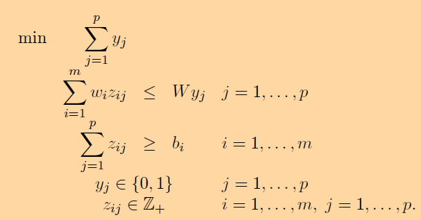
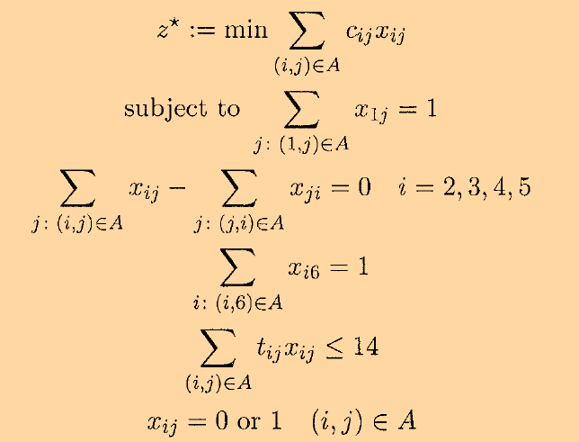

# Dantzig-Wolfe Decompositio solved using Column-Generation
D-W is a reformulation of the original problem using extreme points and extreme rays. Usually, there are enormous number of extreme points and rays, the problem is solved using Column Generation.

The codes are provided for the following problems:

## Cutting stock problem
A paper mill produces large rolls of paper of width W, which are then cut into rolls of various smaller widths in order to meet demand. Let m be the number of different widths that the mill produces. The mill receives an order for bi rolls of width wi for i = 1, . . . ,m, where wi ≤ W. How many of the large rolls are needed to meet the order?

## Shortest path with resource constraints

