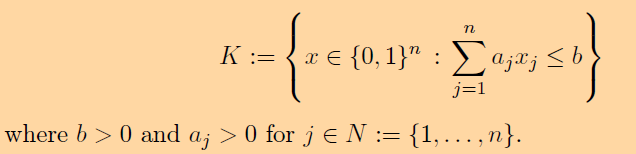
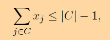
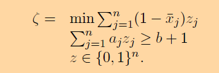

# Knapsack Cover Inequalities

## 0-1 Knapsack Set

The alternate reformulation of the Knapsack set is in terms of cover inequalities. A cover is a subset of items whose total weight is more than the capacity but it becomes less than the capacity once you remove any item from the cover. 

The cover inequality can be produced using the following optimization problem, where z_j denotes whether j denotes whether item j is included in the new cover and x_j_bar is the LP solution of the current knapsack problem.

A lifting procedure is used to strengthen the produced cover inequalities and make them facet defining. 

